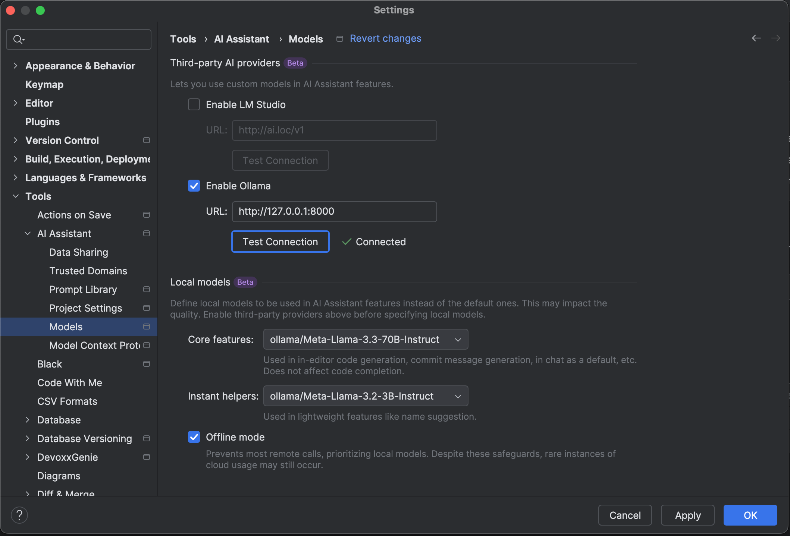

# Ollama-Compatible Proxy for OpenAI Services

A FastAPI-based proxy server that allows using remote OpenAI-compatible services through an Ollama-compatible interface.

## Overview
This script creates a proxy service that mimics the Ollama API interface while actually connecting to OpenAI-compatible services. It allows users to use more advanced remote models while maintaining compatibility with local Ollama setups.

Compatible with Jetbrains IntelliJ IDEA AI Assistant. Also added filtering out <think> section from R1 response, such commit message and application of changes from the assistant.

## Installation

```bash
virtualenv venv && source venv/bin/activate && pip install -r requirements.txt
```

## How to run
Example way to run the service
```bash
export OPENAI_API_URL="https://api.sambanova.ai/v1"
export OPENAI_API_KEY="your-api-key-here"

uvicorn main:app --host 0.0.0.0 --port 8000
```

## Gow to use it with JetBrains AI Assistant

Point your AI Assistant to use the service:



## API Documentation

Trying to follow [Ollama REST](https://www.postman.com/postman-student-programs/ollama-api/collection/suc47x8/ollama-rest-api) api.

## Project Notes

- Provides Ollama API compatibility
- Pretends it is Ollama for model inference
- For some requests, filters out <think> section of model response.
- Supports SambaNova models through OpenAI API compatibility

## Other attempts to do about the same

[ollama-proxy](https://pypi.org/project/ollama-proxy/) - Abandoned

[enchanted-ollama-openrouter-proxy](https://github.com/xsharov/enchanted-ollama-openrouter-proxy/tree/main) - Proxy to use with OpenRouter
